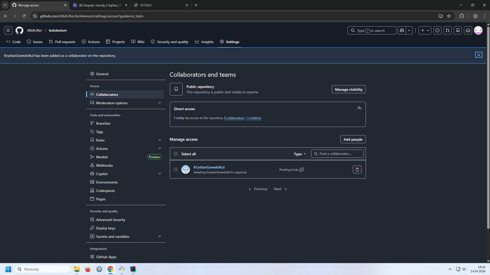
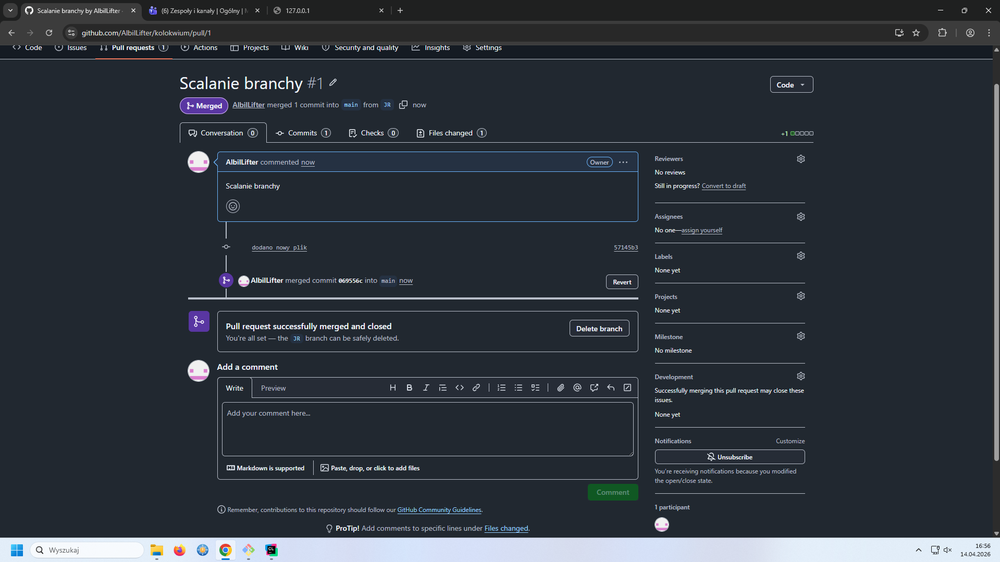
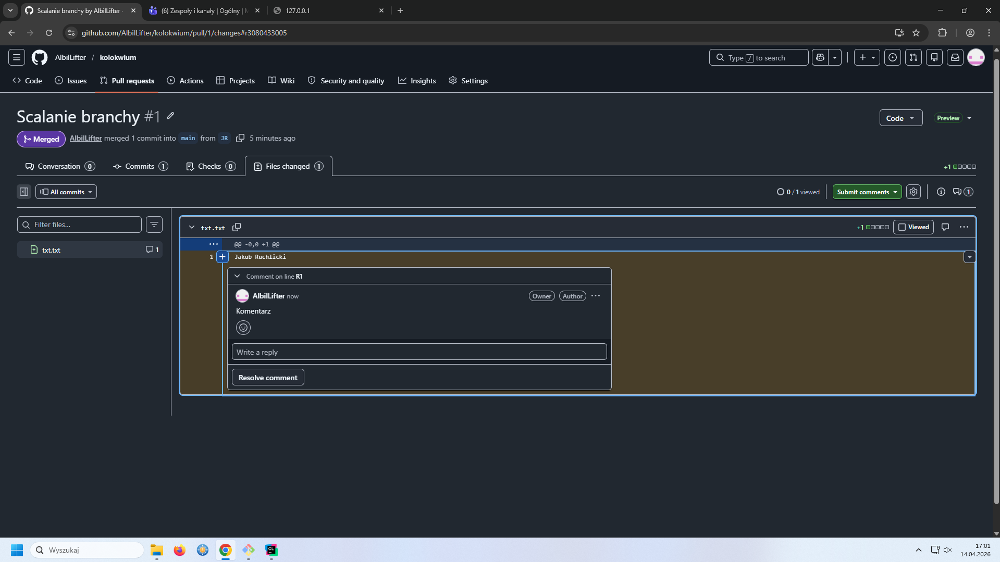

# Zadanie 1

echo "# kolokwium" >> README.md

git init

git add README.md

git commit -m "first commit"

git branch -M main

git remote add origin https://github.com/AlbilLifter/kolokwium.git

git push -u origin main

# Zadanie 2

git branch JR

git branch

git status

git switch JR

git add txt.txt

git commit -m "dodano nowy plik"

git push --set-upstream origin JR

# Zadanie 3

